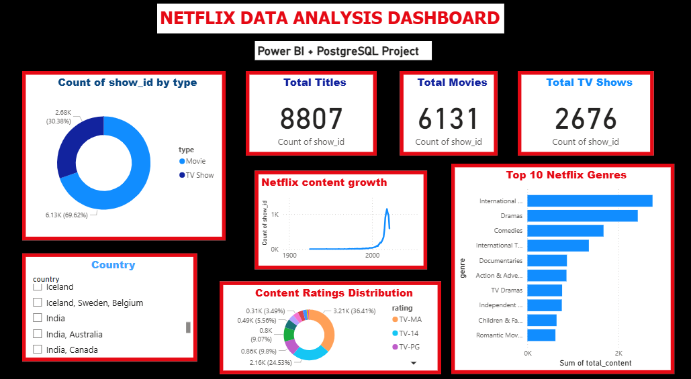

# Netflix Data Analysis using PostgreSQL and Power BI

## Project Overview
This project analyzes Netflix content data using PostgreSQL, SQL, and Power BI to uncover insights about genres, ratings, countries, and content growth trends.

An interactive Power BI dashboard was created to visualize key business insights from the dataset.

---

## Tools & Technologies Used
- PostgreSQL
- SQL
- Power BI
- GitHub

---

## SQL Concepts Used
- GROUP BY
- String Functions
- Date Functions
- ORDER BY
- Filtering & Sorting
- Data Cleaning using `TRIM()` and `UNNEST()`

---

## Dashboard Features
- KPI Cards for Total Titles, Movies, and TV Shows
- Movies vs TV Shows Distribution
- Top 10 Netflix Genres Analysis
- Netflix Content Growth Over Years
- Ratings Distribution Analysis
- Interactive Country Filter (Slicer)

---

## Key Insights
- Movies dominate Netflix content compared to TV Shows.
- International Movies is the most popular genre on Netflix.
- Netflix content growth increased rapidly after 2015.
- TV-MA is the most common content rating.
- Content production slightly declined after 2020 due to pandemic impact and dataset limitations.

---

## Files Included
- `netflix_solution.sql` → SQL queries used for analysis
- `Netflix_Dashboard.pbix` → Power BI dashboard
- `netflix_titles.csv` → Dataset
- `README.md` → Project documentation
- `dashboard.png` → Dashboard preview image

---

## Dashboard Preview

---

## Project Outcome
This project demonstrates:
- SQL querying and data analysis
- Data cleaning and transformation
- Database management using PostgreSQL
- Interactive dashboard creation using Power BI
- Business insight generation from raw data

---

## Author
Anam Shaikh
